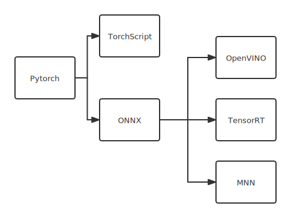
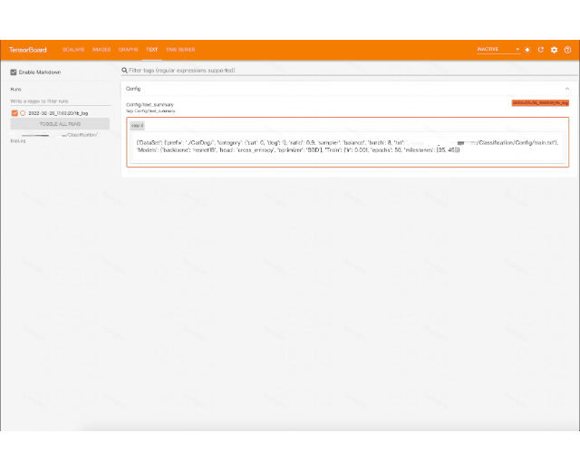
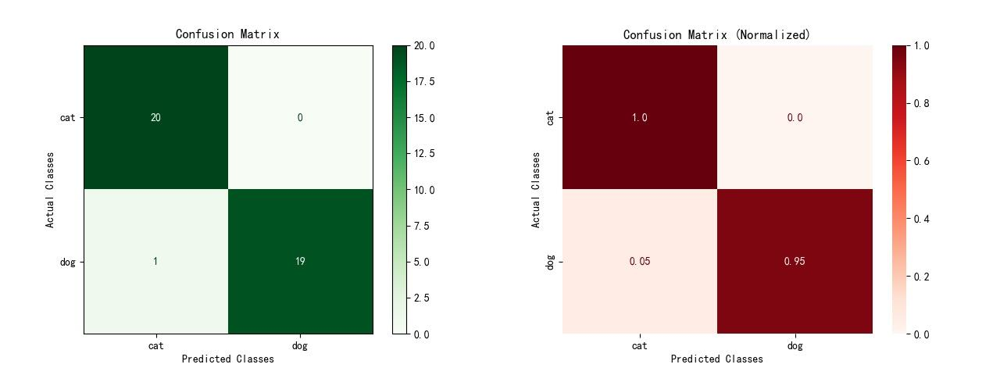
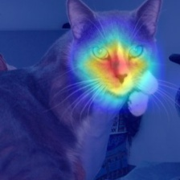
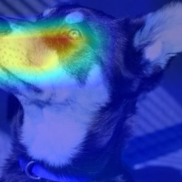

# 图像识别框架🔨


- 收录到[PytorchNetHub](https://github.com/bobo0810/PytorchNetHub)
- [更新日志](https://github.com/bobo0810/Classification/releases)
- [Wiki文档](https://github.com/bobo0810/Classification/wiki)
- [研发看板](https://github.com/bobo0810/Classification/projects?type=classic)
> 自v0.5.0版本开始，仅支持分布式训练。

**!!!基于安全及合规要求，v0.7.0之后的开源版本仅修复bug，不再支持新特性!!!** 

## 亮点

|          | 功能                                                         | 备注                                                         |
| -------- | ------------------------------------------------------------ | ------------------------------------------------------------ |
| 模块化    | 解耦业务与框架                                               | 1. 易用：新任务仅修改`Config/`即可。 <br/>2. 扩展性强：各模块均设统一入口。 |
| 模型     | 集成[Timm](https://github.com/rwightman/pytorch-image-models) | 1. 持续更新SOTA的预训练模型(600+)。<br/>2. 轻松定制模型。                                   |
| 训练 | 集成[ColossalAI](https://github.com/hpcaitech/ColossalAI) | 1. 大规模分布式并行、自动混合精度。<br/>2. 梯度积累、梯度裁剪等。 |
| 可视化   | 集成[TensorBoard](https://github.com/tensorflow/tensorboard) | 1. 数据集: 总体结构、各类占比<br/>2. 模型: 结构、耗时、计算量、参数量等<br/>3. 训练: 参数、损失、图像等 |
| 部署 | 服务器/移动端加速                                                        |  |


## 支持任务

- 图像分类✅
- 度量学习✅ : 人像比对、图像检索等

## 可视化

<center>训练</center>

  <div align=center></div>

<center>测试:支持120+评价指标</center>

  <div align=center></div>

<center>预测:类激活图</center>

  <div align=center></div>

## 扩展框架

```bash
├── Config
│   └── config.py    训练配置
│   └── dataset.txt  数据集 
├── DataSets
│   └── preprocess.py 预处理入口
├── Models
│   ├── Backbone    主干网络入口
│   ├── Optimizer   优化器入口
│   ├── Loss        损失函数入口
│   ├── Backend     模型部署入口
│   ├── Scheduler   学习率调度器入口
```


## 训练配置

|              | 属性      | 支持                                                         |
| ------------ | --------- | ------------------------------------------------------------ |
| 图像预处理   | Process   | - ImageNet           ImageNet预处理<br/>- FaceCompare    人脸比对预处理 |
| 采样策略     | Sampler   | - normal     常规采样<br>- dataset_balance    类别平衡采样(数据集维度)  <br>- batch_balance    类别平衡采样(batch维度)⭐️ |
| 学习率调度器 | Scheduler | - CosineLR⭐️ <br/>- MultistepLR                               |
| 优化器       | Optimizer | - SGD<br/>- Adam<br/>- Lamb                                  |
| 主干网络     | Backbone  | - [600+ SOTA预训练模型](https://github.com/bobo0810/Classification/wiki/%E8%87%AA%E5%AE%9A%E4%B9%89%E4%B8%BB%E5%B9%B2%E7%BD%91%E7%BB%9C) |


|   常规分类   | 属性  | 支持                                                         |
| ------------ | --------- | ------------------------------------------------------------ |
| 损失函数     | Loss      | - CrossEntropy<br>- LabelSmooth         |


| 度量学习 | 属性 | 支持                                                         |
| -------- | -------- | ------------------------------------------------------------ |
| 损失函数 | Loss     | - CosFace<br/>- ArcFace⭐️<br/>- SubCenterArcFace<br/>- CircleLoss |


## 感谢

- 教程
  - [Timm快速上手](https://towardsdatascience.com/getting-started-with-pytorch-image-models-timm-a-practitioners-guide-4e77b4bf9055)
  - [TensorRT安装教程](https://www.codeleading.com/article/48816068405/)
- 开源库
  - [Yolov5目标检测库](https://github.com/ultralytics/yolov5)
  - [Timm预训练模型库](https://github.com/rwightman/pytorch-image-models)
  - [PyCM多类指标统计库](https://github.com/sepandhaghighi/pycm)
  - [torchinfo模型统计库](https://github.com/TylerYep/torchinfo)
  - [torchsampler均衡采样库](https://github.com/ufoym/imbalanced-dataset-sampler)
  - [pytorch-grad-cam类激活映射库](https://github.com/jacobgil/pytorch-grad-cam)
  - [pytorch-metric-learning度量学习库](https://github.com/KevinMusgrave/pytorch-metric-learning)
  - [ColossalAI大规模分布式训练库](https://github.com/hpcaitech/ColossalAI)
  - [MNN移动端推理库](https://github.com/alibaba/MNN)
  

