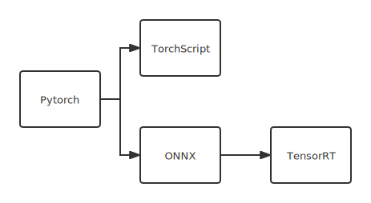
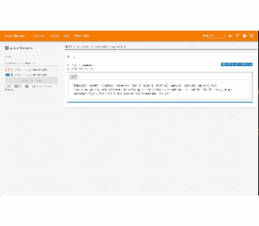

## 亮点

|          | 功能                                                         | 备注                                                         |
| -------- | ------------------------------------------------------------ | ------------------------------------------------------------ |
| 抽象     | 解耦业务与框架                                               | 1. 易用：新任务仅修改`Config/`即可。 <br/>2. 扩展性强：各模块均设统一入口。 |
| 模型     | 集成[Timm模型库](https://github.com/rwightman/pytorch-image-models)  | 1. 持续更新SOTA的预训练模型(600+)。<br/>2. 轻松定制模型。                                   |
| 可视化   | 集成[TensorBoard](https://github.com/tensorflow/tensorboard) | 可视化参数、损失、训练图像、模型结构等。                     |
| 部署 | 服务器/移动端加速                                                        |  |

<div align=center></div>


## 支持任务

- 图像分类✅
- 特征对比✅
- 度量学习  TODO

## 快速开始

1. 下载源码，安装依赖。
    ```bash
    pip install    ./Package/*zip  &&
    pip install -r ./Package/requirements.txt 
    ```
    
2. 训练：执行`python train.py`

    > 注：示例数据集和训练参数已配好，可直接训练。

3. 测试：`Config/test.yaml`配置权重，执行`python test.py`

## API文档

https://bclassification.readthedocs.io/   文档内容包含：

- 最佳实践
- 自定义数据集
- 自定义主干网络
  - 方案1：Timm库
  - 方案2：自定义
  - 附：基于Timm库定制
- 模型部署
  - TorchScript、ONNX、TensorRT的转换、推理、验证。

> 注：自定义 图像增广 | 损失函数 | 优化器| 模型部署| 学习率调度器 均在各自模块内修改即可

## 框架

```bash
├── Config
│   └── *.yaml 训练参数
│   └── *.txt  数据集 
├── DataSets
│   └── preprocess.py 图像增广
├── Models
│   ├── Backbone    主干网络
│   ├── Optimizer   优化器
│   ├── Loss        损失函数
│   ├── Scheduler   学习率调度器
│   ├── Backend     模型部署
├── export.py
├── test.py
└── train.py
```


## 训练参数

|              | yaml属性  | 支持                                                         |
| ------------ | --------- | ------------------------------------------------------------ |
| 采样策略     | sampler   | - normal     常规采样<br>- balance    类别平衡采样 ⭐️         |
| 主干网络     | backbone  | - [600+ SOTA预训练模型](https://bclassification.readthedocs.io/en/latest/backbone.html)  |
| 损失函数     | loss      | - cross_entropy<br>- label_smooth         |
| 优化器       | optimizer | - sgd<br/>- adam<br/>- lamb<br/>- rmsproptf  |
| 学习率调度器 | scheduler | - multistep<br/>- cosine                                     |

## 参考
- [Yolov5](https://github.com/ultralytics/yolov5)
- [Timm预训练模型库](https://github.com/rwightman/pytorch-image-models)
- [Timm快速上手](https://towardsdatascience.com/getting-started-with-pytorch-image-models-timm-a-practitioners-guide-4e77b4bf9055)
- [TensorRT安装教程](https://www.codeleading.com/article/48816068405/)
- [TorchMetrics指标度量库](https://github.com/PytorchLightning/metrics)

