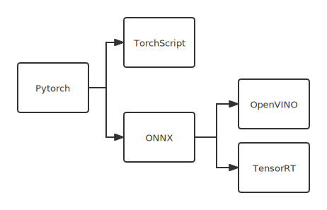
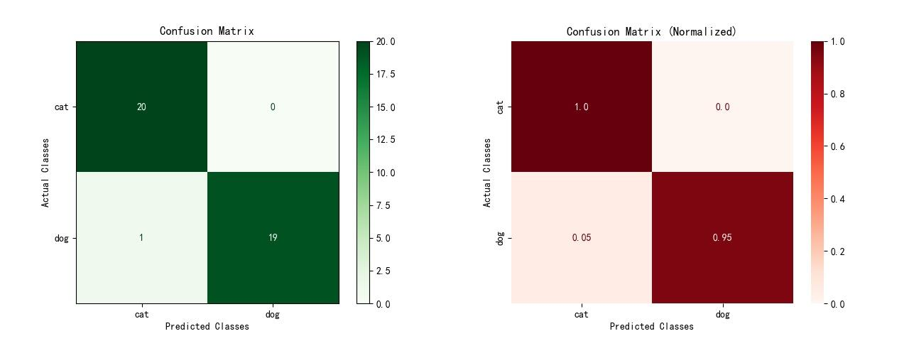
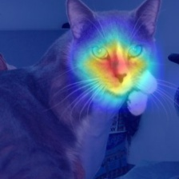

# 图像识别框架Classification

[](https://github.com/bobo0810/Classification/actions)

- 收录到[PytorchNetHub](https://github.com/bobo0810/PytorchNetHub)
- [更新日志](https://github.com/bobo0810/Classification/releases)


## 亮点

|          | 功能                                                         | 备注                                                         |
| -------- | ------------------------------------------------------------ | ------------------------------------------------------------ |
| 模块化    | 解耦业务与框架                                               | 1. 易用：新任务仅修改`Config/`即可。 <br/>2. 扩展性强：各模块均设统一入口。 |
| 模型     | 集成[Timm模型库](https://github.com/rwightman/pytorch-image-models)  | 1. 持续更新SOTA的预训练模型(600+)。<br/>2. 轻松定制模型。                                   |
| 可视化   | 集成[TensorBoard](https://github.com/tensorflow/tensorboard) | 可视化参数、损失、图像、模型结构等。 |
| 解释性 | 集成[pytorch-grad-cam](https://github.com/jacobgil/pytorch-grad-cam) | 持续更新SOTA的注意力可视化算法(8+)。 |
| 部署 | 服务器/移动端加速                                                        |  |


## 支持任务

- 图像分类✅
- 度量学习/特征对比✅

## 快速开始

1. 安装依赖
    ```bash
    pip install    ./Package/*zip  &&
    pip install -r ./Package/requirements.txt 
    ```
    
2. 训练：已配好示例数据集和参数，执行`python train.py`
  <div align=center></div>


3. 测试：`Config/test.yaml`配置权重，执行`python test.py`

   > 支持126个评价指标（总体65+各类别61）
  <div align=center></div>
4. 推理

  ```bash
    python predict.py -weights 权重路径  --vis_cam # 可视化注意力图
  ```
  <div align=center></div>


## 小白上手

**Google Colab notebooks** :  免费GPU资源，运行。即将支持


## [Wiki文档](https://github.com/bobo0810/Classification/wiki)

- 最佳实践
- 自定义数据集
- 自定义主干网络
  - 方案1：Timm库
  - 方案2：自定义
  - 附：基于Timm库定制
- 模型部署
  - 全流程支持 转换->加载->推理->验证误差。

## 扩展框架

```bash
├── Config
│   └── *.yaml 训练参数
│   └── *.txt  数据集 
├── DataSets
│   └── preprocess.py 图像增广入口
├── Models
│   ├── Backbone    主干网络入口
│   ├── Optimizer   优化器入口
│   ├── Loss        损失函数入口
│   ├── Scheduler   学习率调度器入口
│   ├── Backend     模型部署入口
├── export.py
├── predict.py
├── test.py
└── train.py
```


## 训练参数

|   常规分类   | yaml属性  | 支持                                                         |
| ------------ | --------- | ------------------------------------------------------------ |
| 采样策略     | sampler   | - normal     常规采样<br>- dataset_balance    类别平衡采样(数据集维度)  <br>- batch_balance    类别平衡采样(batch维度)⭐️        |
| 主干网络     | backbone  | - [600+ SOTA预训练模型](https://bclassification.readthedocs.io/en/latest/backbone.html)  |
| 损失函数     | loss      | - cross_entropy<br>- label_smooth         |
| 优化器       | optimizer | - sgd<br/>- adam<br/>- lamb<br/>- rmsproptf  |
| 学习率调度器 | scheduler | - multistep<br/>- cosine ⭐️                                     |

| 度量学习 | yaml属性 | 支持                                                         |
| -------- | -------- | ------------------------------------------------------------ |
| 主干网络 | backbone | 支持600+预训练模型，[参考定义](./Models/Backbone/mynet_metric.py) |
| 损失函数 | loss     | - cosface<br/>- arcface⭐️<br/>- subcenter_arcface<br/>- circleloss |

## 感谢

- 教程
  - [Timm快速上手](https://towardsdatascience.com/getting-started-with-pytorch-image-models-timm-a-practitioners-guide-4e77b4bf9055)
  - [TensorRT安装教程](https://www.codeleading.com/article/48816068405/)
- 开源库
  - [Yolov5目标检测库](https://github.com/ultralytics/yolov5)
  - [Timm预训练模型库](https://github.com/rwightman/pytorch-image-models)
  - [PyCM多类指标统计库](https://github.com/sepandhaghighi/pycm)
  - [torchinfo模型统计库](https://github.com/TylerYep/torchinfo)
  - [pytorch-grad-cam类激活映射库](https://github.com/jacobgil/pytorch-grad-cam)
  - [pytorch-metric-learning度量学习库](https://github.com/KevinMusgrave/pytorch-metric-learning)
  

